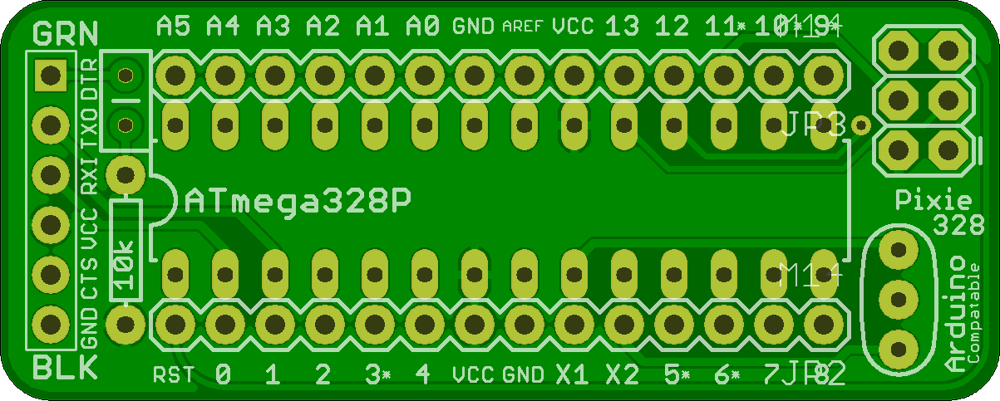

## Pixie 328

This is a very bare minimum breadboard Arduino board. 

It uses a standard FTDI connector on one end to program the ATtiny85 Micro controller with, and has a ICSP header to burn the boot loader on the other end. 

It also has a place for a ceramic frequency clock, and an optional reset pullup resistor. 

The pull-up resistor is optional, as the internal pull-up will work, unless you expressly turn it off. 

Bare minimum, and inspired by Dale Wheat's breadboard Arduino. 

## Pixie328 

### Board dimensions

* (200000, 80000) original units
* (2.0000, 0.8000) inches
* (50.8000, 20.3200) mm

| Front | Back |
| --- | --- |
|  |  |

